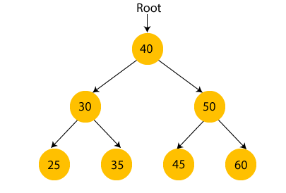

# Data Structure

## Hash Table
### Features
- hashcode는 정수로 이루어짐 -> 중복이 발생할 가능성이 있을 수 밖에 없음
- 입력받은 키값으로 해시코드 생성 -> 인덱스 키값으로 사용 -> 저장된 값 접근
- Hash Algorithm -> Collision 주의
- 충돌이 일어나면 값은 `LinkedList` 형태로 저장 (최악의 경우 시간 복잡도는 O(1)에서 -> O(n)로 바뀐다)
- 해시함수를 잘 만들면 충돌 위험이 적어짐
- Hash Table (synchronized) / Hash Map (not synchronized)

## Binary Search Tree [참고](https://www.javatpoint.com/binary-search-tree)
- 계층 형식으로 되어 있는 자료 구조
- 계층 형태가 노드로 연결되어 있는 객체 컬렉션 혹은 엔티티
- 트리는 선형이나 순차적으로 데이터를 저장하지 않기 때문에 비선형 데이터 구조이다.
- 루트 노드를 기준으로 왼쪽 서브 트리는 루트 노드보다 작은 값들로 구성되고 오른쪽 서브 트리는 큰 값들로 구성되어 있음
  - 루트 노드와 같은 값의 경우 일반적으로 왼쪽에 위치

