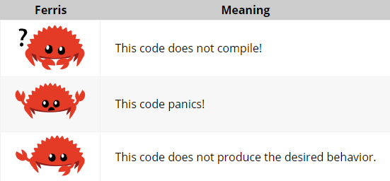

# Rust Programming Language [Book](https://doc.rust-lang.org/book/ch00-00-introduction.html)
[_책 소스 코드_](https://github.com/rust-lang/book/tree/main/src)

> Chapter 1. How to install Rust  
> Chapter 2. Hands-on introduction to writing a program  
> Chapter 3. Covers Rust features that are similar to those of other programming languages  
> Chapter 4. Rust's ownership system  
> Chapter 5. Discusses structs and methods  
> Chapter 6. Covers enums  
> Chapter 7. Rust’s module system and about privacy rules for organizing your code and its public application programming interface (API)  
> Chapter 8. Common collection data structures  
> Chapter 9. Rust’s error-handling philosophy and techniques  
> Chapter 10. Generics, Traits, and Lifetimes  
> Chapter 11. Testing  
> Chapter 12. Implementation of a subset of functionality from the grep command line tool  
> Chapter 13. Explores closures and iterators  
> Chapter 14. Examine Cargo in more depth and talk about best practices  
> Chapter 15. Discusses smart pointers  
> Chapter 16. Models of concurrent programming  
> Chapter 17. How Rust idioms compare to object-oriented programming principles   
> Chapter 18. Reference on patterns and pattern matching  
> Chapter 19. Smorgasbord of advanced topics of interest  
> Chapter 20. Implement a low-level multithreaded web server

  
