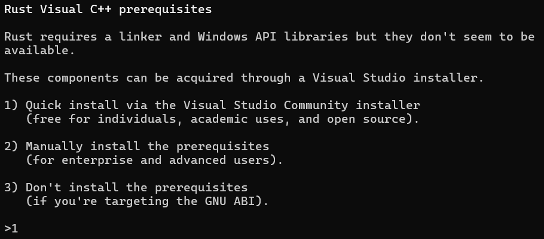
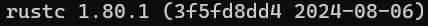

# Chapter 1
[Rust 설치](https://www.rust-lang.org/tools/install)

## 설치
1. 설치 파일 다운로드 후 실행하고 1번 입력

2. Visual Studio가 추가로 설치 된다.
3. 설치 완료 후 버전 확인
  ```
  $ rustc --version 
  ```
  - 버전 번호, 커밋 해쉬, 그리고 커밋 날짜 형식으로 출력된다.
    ```
    rustc x.y.z (abcabcabc yyyy-mm-dd)
    ```
      
위의 정보가 확인되면 설치 완료
- 위의 정보가 보이지 않으면 아래 명령어로 확인
  - Windows CMD
    ```
    > echo %PATH%
    ```
  - PowerShell
    ```
    > echo $env:Path
    ```
  - Linux or macOS
    ```
    $ echo $PATH
    ```
4. 업데이트, 설치 삭제
  - `rustup`을 통해서 설치 되었으면 아래 명령어로 업데이트, 설치 삭제가 가능하다.
    - 업데이트
      ```
      $ rustup update
      ```
    - 삭제
      ```
      $ rustup uninstall
      ```

## 로컬 문서
- Rust를 설치하면 로컬에 카피 문서가 포함된다.
```
$ rustup doc
```

## Cargo
> - Rust 빌드 시스템
### Tasks
- 코드 빌드
- 라이브러리 다운로드
- 라이브러리 빌드

- 대부분의 Rust 프로그램은 Cargo를 빌드 툴로 사용하기 때문에 공식 설치 파일을 다운로드 받아서 설치 했으면 Cargo도 같이 설치가 된다.
  - Cargo 버전 확인
    ```
    $ cargo --version
    ```
    
[여기부터 스터디 이어서 진행하기👉](https://doc.rust-lang.org/book/ch01-03-hello-cargo.html#:~:text=Creating%20a%20Project%20with%20Cargo)